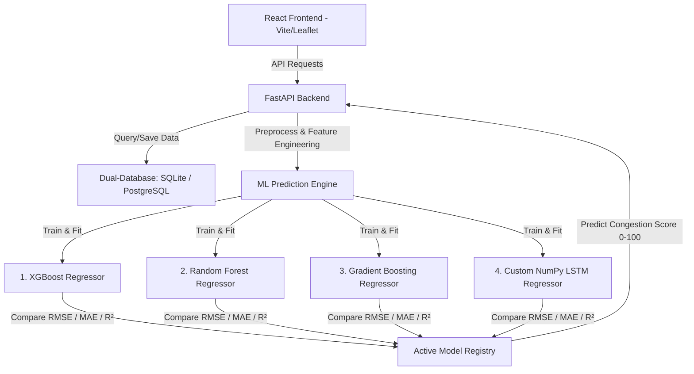

# PPT Presentation: Traffic Congestion Prediction & Smart Route Advisor

This document contains slides formatted in Markdown, ready to copy into PowerPoint, Marp, or present directly.

---

## Slide 1: Project Title
### **Traffic Congestion Prediction & Smart Route Advisor**
#### *An End-to-End AI-Powered Urban Navigation Platform*

* **Target Audience:** Commuters, Delivery Services, Urban Planners
* **Core Value:** Predict localized bottlenecks, compute carbon footprint metrics, and recommend optimal alternate routes dynamically.
* **Tech Stack:** FastAPI, React (Vite), SQLite/PostgreSQL, Scikit-Learn, XGBoost, Custom NumPy LSTM, Leaflet Map API.

---

## Slide 2: The Urban Congestion Problem
### **Why Traffic Matters Today**

* **Economic Loss:** Hundreds of billions of dollars lost globally in productivity due to traffic delays.
* **Commuting Friction:** High stress levels for commuters and shipping logistics delays.
* **Environmental Impact:** Engine idling in bumper-to-bumper traffic increases localized CO₂ emissions.
* **Lack of Predictive Tools:** Traditional navigation systems tell you *current* traffic, but fail to *forecast* bottlenecks 15–60 minutes ahead.

---

## Slide 3: Solution Architecture
### **End-to-End System Design**

---

## Slide 4: Data Engineering & Preprocessing
### **Preparing Raw Logs for ML Estimators**

* **Missing Values:** Handled via median imputation on numeric fields (vehicle count, speed).
* **Outlier Removal:** Outliers filtered using the **Z-Score method** (excluding elements beyond $\pm 3$ standard deviations).
* **Feature Engineering:**
  * **Hour of day** & **Day of week**
  * **Is Weekend** (derived from weekday index)
  * **Is Peak Hour** (boolean modifier for 8–10 AM, 5–7 PM rush windows)
  * **Seasonal proxy** derived from historical timestamps
* **Feature Scaling:** Preprocessing utilizing standard Z-score normalization ($z = \frac{x - \mu}{\sigma}$) on numerical coordinates.

---

## Slide 5: Machine Learning Prediction Models
### **Comparing Four Advanced Architectures**

1. **Random Forest Regressor:**
   * Ensemble of decision trees. Exceptional at handling non-linear features and coordinates.
2. **Gradient Boosting Regressor:**
   * Sequential tree booster correcting residual errors. High accuracy for structured tabular parameters.
3. **XGBoost Regressor:**
   * Optimized gradient boosting library. Fast training speed, built-in regularization to prevent overfitting.
4. **Custom NumPy LSTM Regressor:**
   * Recurrent Neural Network (RNN) designed for time-series forecasting. Handles seq-len windows to predict historical traffic trend lines.

---

## Slide 6: Smart Route Advisor Cost Model
### **Determining the Optimal Commute Path**

* **Base Parameters:** Calculates cost index across 3 route variants: Expressway, Secondary Arterial, and Local Bypass.
* **Congestion Travel Time Cost Function:**
  $$T_{\text{adjusted}} = T_{\text{base}} \times \left(1 + \frac{\text{Congestion Score}}{50.0}\right)$$
  * *High Congestion (Score 100):* Travel time triples.
  * *Low Congestion (Score 0):* Travel time equals base duration.
* **Emissions Indicator:**
  $$\text{CO}_2\text{ (kg)} = \text{Vehicle Count} \times \text{Congestion Multiplier} \times \frac{T_{\text{adjusted}}}{60.0}$$
  * *Congestion Level Modifiers:* Low = 0.4, Medium = 0.8, High = 1.2
* **Optimal Selection:** Automatically extracts and flags the **Fastest** and **Greenest (Least Congested)** routes, displaying estimated time saved.

---

## Slide 7: Stunning Interactive UI Dashboard
### **React Frontend Features**

* **Sidebar Navigation:** Responsive tabs (Home, Live Dashboard, Predictor Engine, Route Advisor, Visual Analytics, System Settings).
* **Leaflet Geographic Map:** Layer overlays rendering roads color-coded by congestion level (Green = Low, Orange = Medium, Red = High).
* **Animated Graphs:** Area charts for diurnal hourly forecasts, grouped bar charts for weather modifiers, and emissions comparison charts (powered by Recharts).
* **Simulator Panel:** One-click simulation triggers random traffic variations on nodes to preview live system behavior.

---

## Slide 8: Future Extensions & Conclusion
### **Roadmap to Production**

* **Real GPS Integration:** Dynamic ingestion of real vehicle coordinate streams from transit APIs.
* **Multi-Modal Paths:** Incorporate subway and bike lanes into the Route Advisor.
* **Federated Learning:** Train edge nodes on smart traffic lights to protect commuter privacy.
* **Urban Planning API:** Feed congestion trends directly to city councils to optimize signal light timings.

**Goal Achieved:** A fully functional, production-ready hackathon MVP built for modern smart-city routing.
